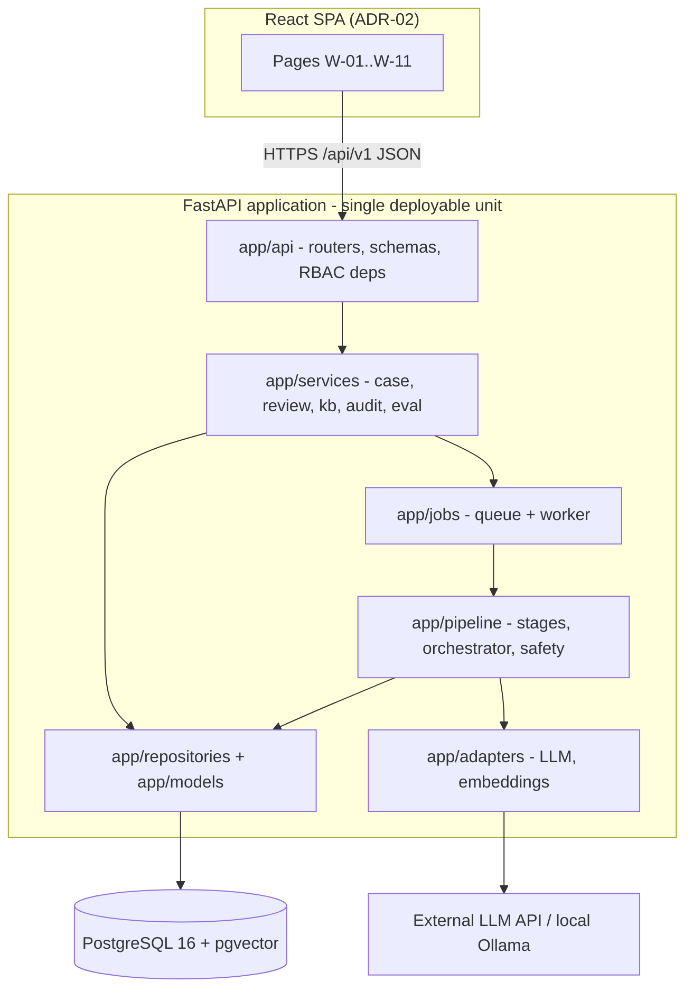

# ADR-01: Modular monolith for the backend

- **Status:** Accepted
- **Deciders:** Letada, Alzaga, Bataller
- **Requirements:** NFR-24, NFR-26, NFR-06
- **Supersedes / superseded by:** —

## Context

TriageAI is a one-semester academic project built by three students who are also
writing the SRS, design and evaluation documents. The prototype must be
installable by the professors with one command, and it must be maintainable by
people who are learning the stack.

The backend has clearly separable concerns: request handling, case workflow, the
AI triage pipeline, the knowledge base, auditing and evaluation. A microservice
per concern would express that separation in deployment, but it would multiply
the operational work: service discovery, inter-service authentication, several
images, distributed tracing and cross-service transactions for something that
handles a few cases per minute in one clinic.

## Decision

Build the backend as a **single deployable application** (one FastAPI process,
one image) with **enforced internal module boundaries**:

```
app/api/          HTTP routing, request/response schemas, auth dependencies
app/services/     business rules and workflow (case, review, kb, audit, eval)
app/pipeline/     the triage pipeline: stages, orchestrator, safety validator
app/adapters/     outbound ports: LLM, embeddings
app/repositories/ database access
app/models/       SQLAlchemy models
app/jobs/         background job queue and worker
```

Dependency rule, enforced in review and by import checks:

`api -> services -> (pipeline | repositories) -> models`

- Routers contain no business logic.
- Services never import FastAPI.
- `pipeline` and `adapters` never import `api`.
- Anything crossing a boundary goes through a function signature, not a shared
  global.

## Diagram



## Consequences

**Positive**

- One image, one `docker compose up`, one log stream. Setup instructions stay
  short enough for the PD8 submission.
- Case creation, extraction storage and audit writes share one database
  transaction, so a half-written case cannot exist.
- The module layout maps onto the three team lanes (backend, AI pipeline,
  frontend) without forcing a service boundary between them.

**Negative**

- Nothing physically prevents a shortcut import from `pipeline` into `api`.
  Mitigated by the dependency rule above and code review.
- The whole application restarts to deploy a change in any module.
- Scaling is per-process, not per-component. Acceptable: expected load is a few
  cases per minute.

## Alternatives considered

| Option | Why rejected |
|---|---|
| Microservices (pipeline as its own service) | Operational cost far exceeds the benefit at this scale; adds failure modes the team cannot properly test in the time available |
| Serverless functions | Embedding model load time and a persistent job worker fit poorly with short-lived functions |
| Single-file application | No boundaries, becomes unmaintainable across three parallel workstreams |

## Implementation notes for future work

- New functionality gets a service in `app/services/` and a router in
  `app/api/v1/`. Do not put queries in routers.
- If a module ever needs to become a service, the adapter interfaces
  (ADR-06, ADR-07) are the seams to cut at.
