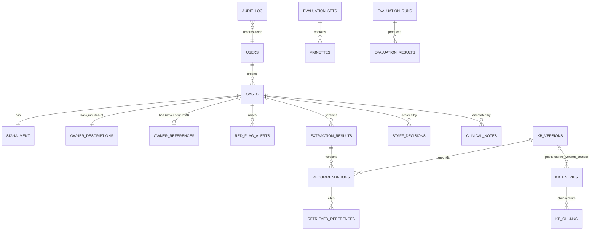

# ADR-04: One PostgreSQL 16 database with pgvector

- **Status:** Accepted
- **Requirements:** DR-01 to DR-08, FR-19, NFR-02, SR-15
- **Related:** ADR-01, ADR-07, ADR-12, ADR-14

## Context

The system stores two kinds of data: ordinary relational records (users, cases,
decisions, audit entries, evaluation runs) and knowledge-base chunk embeddings
for similarity search. Records must be consistent with each other — a
recommendation is meaningless without the extraction and the KB version it came
from — and the audit trail must be enforceable at the storage layer (ADR-12).

The knowledge base is small: roughly 20 to 40 curated entries, a few hundred
chunks. This is far below the scale where a dedicated vector database earns its
operational cost.

## Decision

Use **one PostgreSQL 16 instance** for everything, with the **pgvector**
extension for similarity search. Image: `pgvector/pgvector:pg16`.

- Schema is managed by **Alembic** migrations. No manual schema edits.
- The `embedding vector(384)` column on `kb_chunks` and its **HNSW** index
  (`vector_cosine_ops`, `m = 16`, `ef_construction = 64`) are added by a separate
  migration, because they depend on the embedding model choice (ADR-07).
- Distance operator: cosine (`<=>`). Embeddings are stored normalised, so
  `score = 1 - distance`.
- The application connects as a restricted role (`triageai_app`); migrations use
  the owner role (ADR-12).

## Data model overview

## Consequences

**Positive**

- A recommendation, its references and its audit entry commit in one
  transaction. With a separate vector store, a crash between two writes would
  leave a recommendation citing passages that were never recorded.
- One backup covers all data: a single `pg_dump` is the restore unit (SR-15).
- One database to install, so the PD8 installation instructions stay short.

**Negative**

- pgvector's HNSW applies filters (species, KB version) after the approximate
  scan, so a highly selective filter can return fewer than *k* rows. Mitigated by
  over-fetching (`k * 4`) and a tunable `hnsw.ef_search`.
- The database becomes the single point of failure and the scaling bottleneck.
  Accepted for an evaluation deployment; the daily encrypted dump is the
  recovery path.

## Alternatives considered

| Option | Why rejected |
|---|---|
| Dedicated vector DB (Qdrant, Chroma, Pinecone) | A second service and a second consistency domain for a few hundred vectors; cross-store transactions would have to be hand-rolled |
| SQLite + a file-based index | No concurrent writers, no row-level grants, no append-only enforcement |
| In-memory index rebuilt at startup | Lost on restart; KB versioning (ADR-14) would have no durable anchor |

## Implementation notes

- Never add a vector column or index outside a migration.
- Indexes that already exist and must be kept: `cases(status, created_at)`,
  `recommendations(case_id, version DESC)`, `audit_log(entity_type, entity_id, ts)`,
  `jobs(status, run_after)`.
- Retrieval always filters by the published KB version (ADR-14) and by species.
