# ADR-05: Retrieval-augmented generation instead of fine-tuning

- **Status:** Accepted
- **Requirements:** FR-19 to FR-28, BR-04, BR-06, NFR-17, NFR-18
- **Related:** ADR-06, ADR-07, ADR-09, ADR-14

## Context

Every urgency recommendation must be traceable to veterinary source material
that a licensed veterinarian has approved (BR-04), and the reviewer must be able
to open the passages the recommendation relied on (FR-24). The project has no
labelled corpus of veterinary triage cases, no GPU budget and no clinical
authority to invent guidance.

A fine-tuned model would bury its knowledge in weights: unciteable, unfixable
without retraining, and impossible for a veterinarian to review before use.

## Decision

Use **retrieval-augmented generation** over a **manually curated, versioned
knowledge base**. No model training or fine-tuning is in scope.

Pipeline shape:

```mermaid
flowchart LR
    A["Owner description<br/>(verbatim, English)"] --> B["De-identify<br/>ADR-10"]
    B --> C["Red-flag pre-screen<br/>keyword rules"]
    C --> D["Entity extraction<br/>LLM to JSON"]
    D --> E["Build query text<br/>from extracted fields"]
    E --> F["Embed query<br/>ADR-07"]
    F --> G["pgvector top-k<br/>filtered by KB version + species"]
    G --> H["Generation<br/>LLM: category + rationale + citations"]
    H --> I["Safety validator<br/>ADR-09 (deterministic)"]
    I --> J["Stored recommendation<br/>+ references"]
    J --> K["Veterinary Reviewer decides<br/>FR-31, FR-35"]
```

Rules that follow from this decision:

- Retrieval is restricted to the knowledge base. **No live web search.**
- The generator may cite only the passages it was given; anything else is
  stripped by the validator (FR-22).
- Knowledge changes are content changes, approved through the KB workflow
  (ADR-14), not code changes.

## Consequences

**Positive**

- Every recommendation shows its sources, which is what makes the output
  reviewable and defensible in the PD8 demo.
- A wrong or missing guideline is fixed by editing an entry and publishing a new
  KB version — minutes, not a retraining cycle.
- The veterinarian reviews readable text, not model behaviour.

**Negative**

- Answer quality is bounded by KB coverage. A complaint with no entry produces
  low retrieval scores, which the validator turns into low confidence
  (`LOW_RETRIEVAL_SCORE`).
- Two model calls per case (extraction, generation) instead of one, which
  consumes most of the 10-second median budget (NFR-01).
- Retrieval quality must be measured separately from classification accuracy
  (Recall@5, MRR — NFR-17).

## Alternatives considered

| Option | Why rejected |
|---|---|
| Fine-tuning a smaller model | No labelled dataset; no citations; no GPU; a veterinarian could not review the result |
| Prompt-only, no retrieval | Ungrounded output; the system could not show sources, violating FR-24 and BR-06 |
| Pure rule engine, no LLM | Cannot handle free-text lay descriptions; the project's research question is precisely about transformer-based NLP |
| Live web search at runtime | Unreviewed, unstable sources; unacceptable for clinical decision support |
