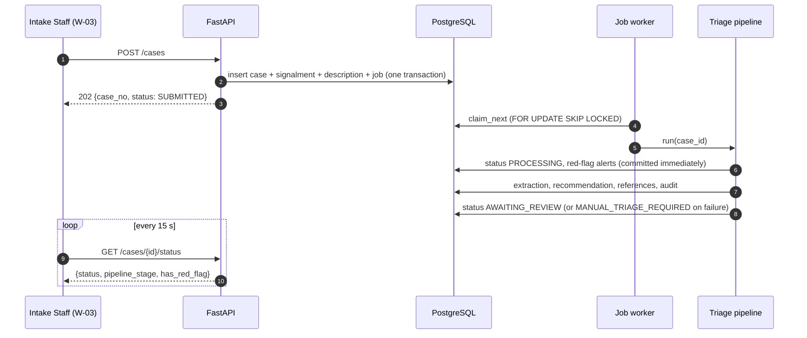

# ADR-08: Database-backed job queue and client polling

- **Status:** Accepted
- **Requirements:** FR-06, FR-07, IR-22, NFR-01, NFR-07, NFR-09, NFR-13
- **Related:** ADR-01, ADR-04, ADR-06, ADR-09

## Context

The triage pipeline takes seconds: two LLM calls, an embedding, and a vector
search. Running it inside the `POST /cases` request would block the Intake Staff
form, and a dropped connection or a browser close would abandon the work. The
case must never be lost, and the queue must never show a case stuck in
`PROCESSING` forever, including after a container restart (NFR-13).

The system already depends on PostgreSQL (ADR-04). Adding Redis or Celery would
add a broker, a second process type, and another failure mode to explain in the
deliverables.

## Decision

Run the pipeline **asynchronously**, with the queue stored in the database and
progress delivered to the browser by **polling**.

- `POST /cases` writes the case, enqueues a `PIPELINE_RUN` job in the same
  transaction, and returns **202 Accepted**.
- A worker thread started from the FastAPI lifespan claims jobs with
  `SELECT ... FOR UPDATE SKIP LOCKED`, so several workers cannot take the same
  job.
- Job types: `PIPELINE_RUN`, `REGENERATE`, `EVAL_RUN`, `KB_INDEX`.
- **Recovery on startup:** jobs left `RUNNING` for more than 2 minutes are reset
  to `QUEUED`. This is what makes a crash mid-pipeline safe.
- Clients poll `GET /cases/{id}/status` and the queue list every **15 s**
  (IR-22); polling pauses while the browser tab is hidden.
- `JOB_WORKER_ENABLED=false` in tests; `run_pending_jobs_once()` runs jobs
  synchronously so tests stay deterministic.

## Consequences

**Positive**

- Intake returns immediately, so staff can record the next case while the AI
  works.
- A case is never lost: the job row is committed with the case, and stale jobs
  are recovered on restart.
- Red-flag alerts are written and committed before the LLM call, so the 2-second
  alert requirement (NFR-05) does not depend on model latency.

**Negative**

- Polling wastes a few requests per minute per open tab, and a status change can
  take up to 15 s to appear. Accepted: it works through the Nginx proxy with no
  extra infrastructure, unlike WebSockets or SSE.
- A worker thread inside the API process means a busy pipeline shares CPU with
  request handling. Acceptable at the expected load; the worker can be split into
  its own container later without changing the queue design.
- A separate timeout budget is needed for a whole job (`2 × timeout_s + 10`),
  or a hung provider call would hold a job forever.

## Alternatives considered

| Option | Why rejected |
|---|---|
| Synchronous processing in the request | Blocks the form for seconds; work lost if the client disconnects |
| Celery + Redis | Extra broker, extra container, extra operational explanation for one queue with a handful of jobs |
| WebSockets / SSE for updates | More moving parts through the proxy; polling every 15 s already meets IR-22 |
| FastAPI `BackgroundTasks` | Dies with the process; no retry, no recovery, no visibility |
