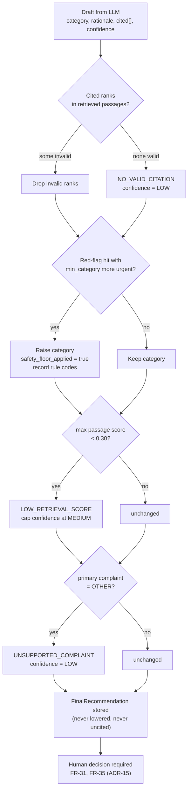

# ADR-09: Deterministic safety and citation validator after generation

- **Status:** Accepted
- **Requirements:** FR-22, FR-23, FR-25, FR-28, NFR-08, NFR-11, NFR-14, BR-02
- **Related:** ADR-05, ADR-06, ADR-14, ADR-15

## Context

The most serious failure mode of this system is **under-triage**: a critical
case given a low urgency category. A language model can produce a fluent,
confident recommendation that cites a passage it never received, or that
downgrades a case with an obvious red flag.

Prompt instructions reduce this, but they are probabilistic. Anything the
project claims about safety must hold every time and must be testable without
calling a model.

## Decision

After generation, a **pure, deterministic function** produces the final
recommendation. The model never writes the stored category directly.

```python
SafetyValidator.finalize(draft, passages, red_flag_hits, extraction, config)
    -> FinalRecommendation
```

Rules, applied in this order:

1. **Citation validation (FR-22).** Drop cited ranks that are not in the
   retrieved passages. If none survive, add `NO_VALID_CITATION` and set
   confidence to LOW.
2. **Safety floor (FR-23, NFR-08).** For each red-flag hit whose `min_category`
   is more urgent than the draft category, raise the category and record the rule
   code. **The category is never lowered.**
3. **Retrieval quality.** If the best passage score is below
   `retrieval_min_score` (0.30), add `LOW_RETRIEVAL_SCORE` and cap confidence at
   MEDIUM.
4. **Unsupported complaint.** If the primary complaint is `OTHER`, add
   `UNSUPPORTED_COMPLAINT_MANUAL_TRIAGE_RECOMMENDED` and set confidence to LOW.
5. **Confidence never increases** above what the model reported.



Note: FR-25 (prefer the more urgent of two tied categories) is instructed in the
generation prompt, because a tie is only visible to the model. The validator can
only raise, never lower.

## Consequences

**Positive**

- The safety property is a property of code, not of a prompt, so it is covered
  by unit tests (at least 15 cases) and cannot regress silently when the model or
  prompt changes.
- The reviewer sees exactly why a category was raised (the rule label appears in
  W-04), which supports the human decision instead of hiding the machinery.
- The same validator runs in the evaluation harness, so measured metrics reflect
  the deployed behaviour.

**Negative**

- The system over-triages more often than the model alone would. That is the
  intended trade: over-triage costs clinic time, under-triage can cost a life.
  Both rates are reported (NFR-16).
- The safety floor depends on red-flag rules being approved and current
  (ADR-14). An unapproved rule does not fire.
- One more place to keep in step with the KB: rule codes referenced here must
  exist in `red_flag_rules`.

## Alternatives considered

| Option | Why rejected |
|---|---|
| Trust the LLM's category directly | Cannot be tested or guaranteed; unacceptable for a safety-relevant output |
| Ask a second LLM to check the first | Still probabilistic, doubles cost and latency, and is harder to explain in the defence |
| Apply the floor before generation | The model would still be free to output a lower category; the floor must be the last word |
