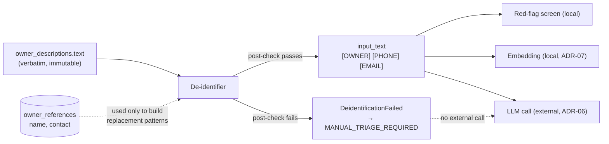

# ADR-10: De-identify before any external call, and fail closed

- **Status:** Accepted
- **Requirements:** FR-12, IR-20, SR-07, SR-08, DR-04, BR-07, BR-08
- **Related:** ADR-05, ADR-06, ADR-07, ADR-12, ADR-16

## Context

Owner descriptions are free text and may contain names, mobile numbers or
addresses, even though the intake form asks staff to keep them out. Under the
Data Privacy Act of 2012 (RA 10173), sending that text to an external LLM
provider would be a disclosure the clinic never agreed to.

The owner's contact details are also stored deliberately, in
`owner_references`, so that staff can call the owner back. That table must never
reach the pipeline.

## Decision

De-identification is the **first stage of the pipeline**, before red-flag
screening and before any model call, and it **fails closed**.

- `RuleBasedDeidentifier` replaces: the stored owner name (full string and
  capitalised name parts of 3+ letters), the stored contact number, Philippine
  mobile and landline patterns, e-mail addresses, and Philippine address markers
  (Blk/Lot/Purok/Brgy/`<number> <Name> St.`).
- Replacements are visible placeholders: `[OWNER]`, `[PHONE]`, `[EMAIL]`,
  `[ADDRESS]`.
- A **post-check** runs after substitution: if anything still matches an e-mail
  or mobile pattern, the stage raises `DeidentificationFailed`. Any internal
  error also raises it.
- On that failure the pipeline stops **before** the LLM call and the case goes to
  `MANUAL_TRIAGE_REQUIRED` with reason `DEIDENTIFICATION_FAILED`.
- The de-identified text is stored as `extraction_results.input_text` and is what
  the review screen highlights evidence against.
- **Startup guard:** the application refuses to start if `LLM_PROVIDER` is not
  `mock` while `PIPELINE_DEIDENTIFIER` is `mock` (ADR-17).
- `owner_references` is never selected by pipeline or export queries (DR-04),
  and its columns never appear in API responses.
- Free text is never logged (see ADR-12); logs carry IDs, stages and timings.

## Consequences

**Positive**

- Only de-identified text can reach an external provider, and the guard makes
  that structural rather than a convention.
- Failing closed means a de-identification bug degrades the system to manual
  triage rather than leaking personal data.
- Because the stored `input_text` is what the model saw, the reviewer's evidence
  highlighting is honest about what was processed.

**Negative**

- Rule-based matching produces false positives (a clinical word that equals a
  name part) and false negatives (an identifier in an unexpected format). Hence
  the case-sensitive, capitalised matching for name parts, and the 12-case test
  suite including clinical numbers that must survive (`vomited 5 times`, `4.2 kg`).
- The reviewer sees placeholders instead of the original words in the highlighted
  view; W-04 states which text the highlights refer to.
- A false positive on a rare description can make extraction harder.

## Alternatives considered

| Option | Why rejected |
|---|---|
| No de-identification, rely on staff instructions | One typed phone number becomes a privacy incident; not defensible under RA 10173 |
| LLM-based de-identification | Would require sending the raw text to the model first — the exact thing being prevented |
| Fail open (continue on error) | A silent failure would send identifiers externally; unacceptable |
| Strip identifiers at input time | The description is stored verbatim by requirement (FR-05); staff need the original for callbacks |
