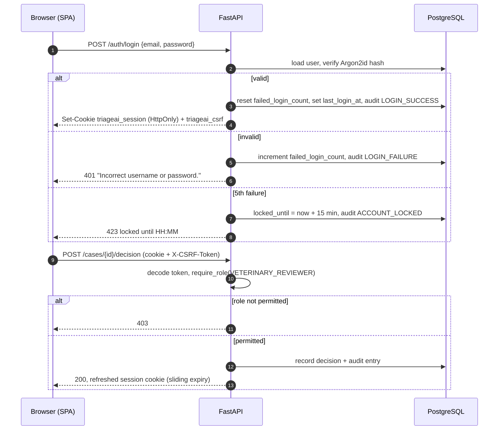

# ADR-11: Cookie sessions with server-side role checks

- **Status:** Accepted
- **Requirements:** FR-57 to FR-62, SR-01 to SR-05, SR-09, SR-12, IR-02
- **Related:** ADR-02, ADR-03, ADR-12, ADR-15

## Context

Three roles exist — `INTAKE_STAFF`, `VETERINARY_REVIEWER`, `ADMINISTRATOR` —
plus a separate `can_approve_kb` permission that only a licensed veterinarian
holds (BR-04). The distinction matters clinically: only a Veterinary Reviewer may
confirm or change an urgency category (BR-01).

The client is a single-page application (ADR-02), so the front end cannot be
trusted to enforce anything. Shared clinic workstations mean an idle session must
expire, and the login form is a brute-force target.

## Decision

**Server-side enforcement, with the session carried in an HttpOnly cookie.**

| Concern | Choice |
|---|---|
| Password hashing | Argon2id (`argon2-cffi` defaults) |
| Session token | JWT (HS256) with `sub`, `role`, `iat`, `exp`, `jti` |
| Transport | Cookie `triageai_session`: `HttpOnly`, `SameSite=Lax`, `Path=/`, `Secure` outside dev |
| Idle timeout | 30 minutes, **sliding**: the cookie is re-issued on each authenticated request (SR-04) |
| CSRF | Double-submit: readable `triageai_csrf` cookie must match the `X-CSRF-Token` header on every state-changing request |
| Lockout | 5 consecutive failures lock the account for 15 minutes; the API returns 423 (SR-03) |
| Login errors | One generic message regardless of cause, so accounts cannot be enumerated |
| First login | `must_change_password` blocks every endpoint except `/auth/*` |
| Authorisation | `require_role(*roles, kb_approver=False)` dependency on **every** endpoint except `/health` and `/auth/login` |

Security events — `LOGIN_SUCCESS`, `LOGIN_FAILURE`, `ACCOUNT_LOCKED`, `LOGOUT`,
`PASSWORD_CHANGED` — are written to the audit log (SR-12, ADR-12).

## Consequences

**Positive**

- An HttpOnly cookie cannot be read by injected JavaScript, unlike a token in
  `localStorage`.
- One dependency (`require_role`) makes authorisation auditable: a route-scanning
  test asserts that every route declares it.
- Lockout plus a generic error message covers the two most likely attacks on a
  small deployment.

**Negative**

- Cookies require CSRF protection, which the token-in-header approach would not.
  Handled by the double-submit check, and the SPA's API client attaches the
  header centrally.
- Stateless JWTs cannot be revoked before expiry; the 30-minute window is the
  bound. A server-side session table was judged unnecessary at this scale, and
  `jti` leaves room to add one.
- Sliding expiry means a re-issued cookie on most requests, which is a small
  overhead.

## Alternatives considered

| Option | Why rejected |
|---|---|
| Bearer token in `localStorage` | Readable by any injected script; worse for a clinical system |
| OAuth / external identity provider | No institutional IdP available; adds a dependency for a handful of clinic accounts |
| Client-side role checks only | Trivially bypassed; the API is the security boundary |
| Session table in the database | More state to manage than needed for a 30-minute window; can be added later via `jti` |
