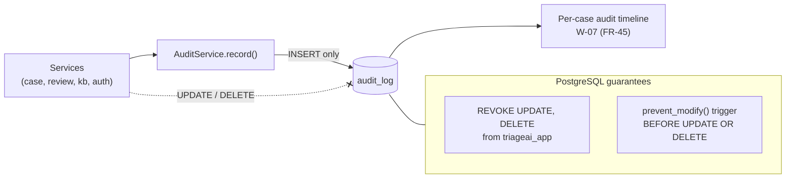

# ADR-12: Append-only audit trail enforced in the database

- **Status:** Accepted
- **Requirements:** FR-05, FR-41 to FR-46, FR-48, SR-12, SR-14, DR-05, BR-03
- **Related:** ADR-04, ADR-10, ADR-11, ADR-14

## Context

TriageAI is decision support for clinical urgency. If a case is later reviewed —
by the clinic, by the professors, or in the project's own evaluation — the record
must show what the AI recommended, what the human decided, who decided it and
when, without any possibility that the record was edited afterwards.

Enforcing this only in application code would mean the guarantee holds exactly as
long as every future code path remembers it.

## Decision

Immutability is enforced at the **database** level, not only in services.

- The application connects as a restricted role `triageai_app`. Migrations run as
  the owner role (`MIGRATION_DATABASE_URL`).
- `REVOKE UPDATE, DELETE ON audit_log` and `REVOKE UPDATE ON owner_descriptions`
  from `triageai_app`.
- A `prevent_modify()` trigger function raises an exception, fired
  `BEFORE UPDATE OR DELETE` on `audit_log`, and `BEFORE UPDATE` on
  `owner_descriptions` and `kb_version_entries`.
- All audit writes go through one `AuditService.record(...)`. Services never
  insert into `audit_log` directly.
- Corrections are **new rows**, never edits:
  - a corrected extraction is a new `ExtractionResult` version (`is_corrected`);
  - a changed decision is a new `StaffDecision` with `amends_id` pointing at the
    original (FR-48);
  - a changed knowledge-base entry is a new revision and a new KB version
    (ADR-14).
- Audit entries record IDs, actions and before/after **category and status**
  values — never free-text case content (ADR-10).

## Consequences

**Positive**

- The guarantee survives a future bug: even a wrong `UPDATE` in new code is
  rejected by the database.
- The timeline shown in W-07 is provably the full history, which is what makes
  the disagreement analysis (AI category vs final category) meaningful.
- Security events and clinical decisions share one ordered log.

**Negative**

- Two database roles and a migration that manipulates grants — more setup, and
  the deployment guide must create the app role's password
  (`DB_APP_PASSWORD`).
- Wrong audit rows cannot be cleaned up; a mistake is corrected by a new entry.
- The audit log grows without bound. Acceptable for the project's lifetime; an
  archival strategy would be future work.
- Tests must run as `triageai_app` to prove the restrictions actually hold.

## Alternatives considered

| Option | Why rejected |
|---|---|
| Application-level discipline only | One forgotten code path silently breaks the guarantee |
| Event sourcing for the whole domain | Far more machinery than the deliverable needs |
| External write-once log service | Extra infrastructure; breaks the single-transaction property with case writes |
