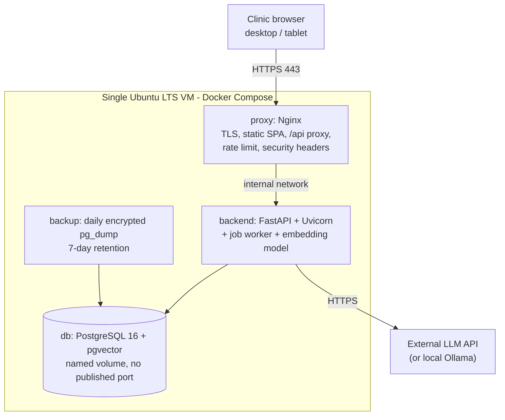

# ADR-13: Docker Compose on a single VM, Nginx terminating TLS

- **Status:** Accepted
- **Requirements:** NFR-04, NFR-06, NFR-24, NFR-26, SR-06, SR-11, SR-15, DR-07
- **Related:** ADR-01, ADR-02, ADR-04, ADR-07

## Context

PD8 requires a prototype the professors can reach, with installation and access
instructions. The team has no budget for managed infrastructure and no time to
learn an orchestrator. Expected load is a handful of concurrent users.

The system also has to run identically on three student laptops, where the AI
stages are often mocked.

## Decision

Package every component as a container and run them with **Docker Compose** on a
**single Ubuntu LTS VM**, with **Nginx** as the only public entry point.

| File | Purpose |
|---|---|
| `docker-compose.yml` | Development: `db`, `backend` (reload), `frontend` (Vite dev server) |
| `deploy/docker-compose.prod.yml` | Production: `proxy`, `backend`, `db`, `backup` |

Production rules:

- Only the `proxy` publishes ports (80, 443). The database publishes **no** port.
- The front end is built in a multi-stage image and served as static files by
  Nginx; `/api/` is proxied to the backend.
- TLS 1.2/1.3 only, certificate from Let's Encrypt (SR-06). Security headers:
  HSTS, `X-Content-Type-Options`, `Referrer-Policy`, `X-Frame-Options: DENY`, a
  basic CSP.
- `/auth/login` is rate-limited at the proxy (10 requests/minute/IP).
- A `backup` container runs a daily `pg_dump -Fc`, encrypted, keeping 7 copies
  (SR-15, DR-07).
- Sizing: 2 vCPU, 8 GB RAM, 40 GB storage. A GPU is required only if a local LLM
  is served on the same host (ADR-06); the local embedding model runs on CPU.

## Consequences

**Positive**

- `docker compose up --build` is the whole install on a laptop, and the
  production file differs only where it must. That is what makes the PD8
  instructions short and reproducible.
- One VM means one set of logs, one backup, one certificate to renew.
- Restart policies plus the job recovery in ADR-08 give usable resilience without
  an orchestrator.

**Negative**

- Single point of failure and no horizontal scaling. Acceptable for an
  evaluation deployment; stated as a limitation.
- Deployment is manual: pull a tag, rebuild, restart. Documented step by step in
  `deploy/README-deploy.md`.
- The backend image is large because the embedding model is baked in (ADR-07),
  so rebuilds are slow on a small VM.
- Certificate renewal must be scheduled, or the demo breaks 90 days later.

## Alternatives considered

| Option | Why rejected |
|---|---|
| Kubernetes | Enormous overhead for four containers and one clinic |
| PaaS (Render, Railway, Fly) | Cost, and less control over the database extension and model cache |
| Bare-metal install without containers | Environment drift between three laptops and the server; the exact problem containers solve |
| Separate database host | More setup and cost for no benefit at this size |
