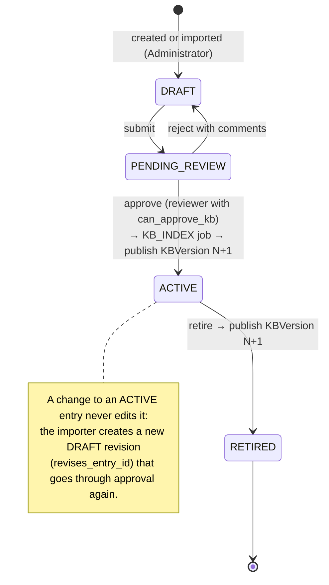

# ADR-14: Versioned prompts, knowledge base and AI outputs

- **Status:** Accepted
- **Requirements:** FR-26, FR-27, FR-51, FR-54, FR-55, NFR-23, DR-05, BR-04
- **Related:** ADR-05, ADR-06, ADR-07, ADR-09, ADR-12

## Context

The project's claim is empirical: measured accuracy, retrieval quality and
latency for a stated configuration (NFR-16, NFR-17, NFR-23). A result is
meaningless if nobody can say which model, which prompt and which knowledge base
produced it. Prompts and KB entries will change several times during
development, and evaluation runs happen before and after those changes.

Clinically, a reviewer looking at an old case must see the passages as they were
when the recommendation was made, even if the entry has since been retired.

## Decision

Everything that influences an AI output is versioned, and the version is stored
with the output.

**Prompts** are files: `backend/prompts/<name>/<version>.md`, selected by
`EXTRACTION_PROMPT_VERSION` and `GENERATION_PROMPT_VERSION`. A published version
is **never edited**; a change is a new file plus an entry in that prompt's
`CHANGELOG.md`.

**Knowledge base** uses an approval workflow and immutable published versions:

- A `KBVersion` lists **all** entries that were `ACTIVE` at publication
  (`kb_version_entries`, immutable — ADR-12).
- Approving or retiring a **red-flag rule** also publishes a version, so the
  safety floor (ADR-09) is versioned too.
- Retrieval always targets one published version.

**Stored with every AI output:** `model_id`, `prompt_version`, `kb_version_id`,
parameters (temperature 0, `top_k`), per-stage latencies, and the passage text
copied into `retrieved_references` so the evidence survives later KB changes.

**Recommendation versions:** a correction (FR-27) creates a new extraction
version and a new recommendation version. Earlier versions stay visible and
read-only; decisions always apply to the latest.

## Consequences

**Positive**

- Any stored recommendation can be explained: which model, which prompt, which
  knowledge, which passages.
- The reproducibility check (NFR-23: at least 95% identical categories on a
  re-run with the same configuration) is possible at all.
- A veterinarian's approval attaches to a specific, frozen version, which is what
  BR-04 requires.

**Negative**

- More rows and more storage: chunks are never deleted, passage text is
  duplicated into references, and every approval adds a version.
- Contributors must remember never to edit a published prompt or an active
  entry. The importer enforces the KB half; prompts rely on review discipline.
- Re-embedding after a model change (ADR-07) interacts with this: prefer
  finishing the model comparison **before** approving entries the first time.

## Alternatives considered

| Option | Why rejected |
|---|---|
| Prompts as strings in code | Changes hide inside diffs; no clean way to record the version on an output row |
| Mutable knowledge base | Old recommendations would silently change meaning; the audit trail would lie |
| Git commit hash as the only version marker | Not visible in the database; does not cover content approved by a veterinarian |
