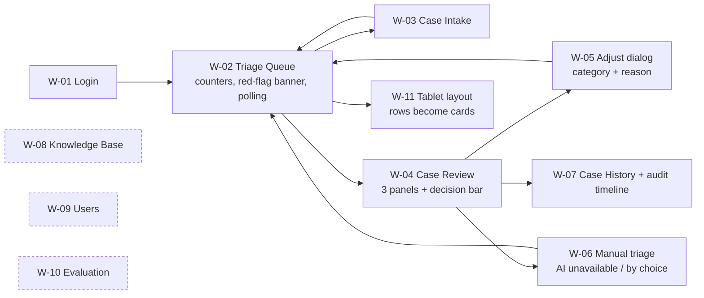

# ADR-15: Three-panel review screen and human-in-the-loop presentation

- **Status:** Accepted
- **Requirements:** FR-29 to FR-38, IR-03 to IR-08, NFR-10, NFR-11, NFR-20 to NFR-22, BR-01, BR-02, BR-09
- **Related:** ADR-02, ADR-09, ADR-11, ADR-16

## Context

The system's clinical value depends on a reviewer being able to check an AI
recommendation quickly and reject it easily. Two well-documented risks shape the
design: **automation bias** (accepting a recommendation without checking) and
**alarm blindness**.

The urgency categories are colour-coded, which fails for colour-blind users and
in print if colour carries the meaning alone (NFR-21).

## Decision

**1. The Case Review screen (W-04) is three panels, evidence first.**

| Panel | Content |
|---|---|
| 1. Owner's description | The text as submitted, with evidence spans highlighted. A note states whether highlights refer to the de-identified text (ADR-10) |
| 2. Extracted information | Complaints, onset, severity, associated signs, negated findings, red flags, and "Ask the owner" (missing information) |
| 3. Recommended urgency | VTL badge, safety-floor notice, rationale, confidence with plain-language reasons, and the cited references with excerpts |

The reviewer reaches the recommendation **after** the evidence, not before it.

**2. AI output is labelled as provisional until a human decides.** The chip
"AI Recommendation – requires staff confirmation" (IR-04) is shown until a
decision exists. The fixed decision bar carries the disclaimer: decision support
only, not a diagnosis (IR-06, BR-09).

**3. Category always appears as colour + name + target time** (IR-03). Yellow
uses dark text. `MANUAL` uses a dashed outline. Colour is never the only carrier
of meaning.

**4. Disagreement is cheap and recorded.** Adjust (W-05) requires a category
different from the recommendation plus a reason code, shows the direction
("Orange → Red, up-triage"), and states that the change is permanent. Manual
triage (W-06) is available at any time, not only after a failure (FR-34).

**5. The system never finalises or silently changes a category** (NFR-11,
BR-01). Intake Staff see W-04 read-only.

## Consequences

**Positive**

- Evidence-before-answer ordering gives the reviewer something to check against,
  which is the main structural defence against automation bias.
- Because the safety floor and low-confidence reasons are shown in words, the
  reviewer knows when the system is unsure and why.
- Text-plus-colour badges work in screenshots, in print and for colour-blind
  users, and satisfy the accessibility target.

**Negative**

- The review screen is dense, so the tablet layout needs deliberate work (W-11).
- Requiring a reason for every adjustment adds friction. Accepted: the reasons
  are the data behind the disagreement analysis.
- Showing confidence and safety-floor details could be misread as precision the
  system does not have, so the wording stays plain and the disclaimer stays
  fixed.

## Alternatives considered

| Option | Why rejected |
|---|---|
| Show the recommendation first, evidence on demand | Encourages one-click acceptance; automation bias |
| One-click accept from the queue | Removes the reading step entirely; unacceptable for a clinical decision |
| Colour-only urgency badges | Fails accessibility and print; meaning must survive without colour |
| Let the system auto-finalise low-urgency cases | Violates BR-01 and NFR-11; an under-triaged Blue case is exactly the failure to avoid |
