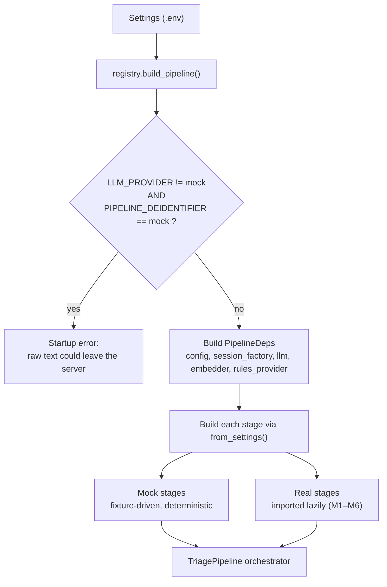

# ADR-17: Mock-first pipeline stages selected by a registry

- **Status:** Accepted
- **Requirements:** NFR-09, NFR-13, NFR-23, NFR-25, IR-19
- **Related:** ADR-05, ADR-06, ADR-07, ADR-09, ADR-10

## Context

The AI components (de-identification, red-flag screening, extraction,
embeddings, indexing, retrieval, generation) are implemented **manually** by the
team, guided by `docs/dev-prompts/M1`–`M7`, while the rest of the application is
built with Claude Code. The two streams run in parallel over the same weeks.

The application therefore has to work end to end before any AI component exists,
CI has to run with no API key and no model download, and switching a component
from placeholder to real must not touch application code.

## Decision

Every pipeline stage is a **Protocol** with at least two implementations —
a deterministic mock and a real one — chosen at startup by
`app/pipeline/registry.py` from settings. **All stage settings default to
`mock`.**

| Setting | Real value → module:class | Guide |
|---|---|---|
| `PIPELINE_DEIDENTIFIER` | `rules` → `app.pipeline.deidentify_rules:RuleBasedDeidentifier` | M1 |
| `PIPELINE_REDFLAGS` | `keywords` → `app.pipeline.redflags_keywords:KeywordRedFlagScreener` | M1 |
| `LLM_PROVIDER` | `hosted` / `ollama` → `app.adapters.llm.hosted` / `.ollama` | M2 |
| `PIPELINE_EXTRACTOR` | `llm` → `app.pipeline.extraction_llm:LLMEntityExtractor` | M3 |
| `EMBEDDING_PROVIDER` | `sentence_transformer` → `app.adapters.embeddings.sentence_transformer` | M4 |
| `KB_INDEXER` | `pgvector` → `app.kb.indexer_pgvector:PgVectorKBIndexer` | M5 |
| `PIPELINE_RETRIEVER` | `pgvector` → `app.pipeline.retrieval_pgvector:PgVectorRetriever` | M6 |
| `PIPELINE_GENERATOR` | `llm` → `app.pipeline.generation_llm:LLMRecommendationGenerator` | M6 |

Rules:

- Every stage class provides `from_settings(settings, deps) -> Self`, where
  `deps` (`PipelineDeps`) carries `config`, `session_factory`, `llm`, `embedder`
  and `rules_provider`.
- Every stage exposes `model_id`, `prompt_version` and `last_latency_ms`, so the
  orchestrator stores provenance identically for mocks and real stages (ADR-14).
- The registry imports real modules **lazily**. A module that does not exist yet
  produces a clear startup error naming its M-guide, not an import crash.
- Mocks are **fixture-driven and deterministic** (`tests/fixtures/demo_cases.yaml`),
  with a `MOCK_LLM_BEHAVIOR` switch (`ok`, `invalid_json`, `timeout`, `flaky`,
  `slow`) that exercises every failure path from ADR-08 without a network call.
- **Safety guard:** the application refuses to start if `LLM_PROVIDER` is not
  `mock` while `PIPELINE_DEIDENTIFIER` is `mock` (ADR-10).

## Consequences

**Positive**

- The whole application — intake, queue, review, decisions, audit, evaluation —
  is demonstrable and testable before any AI component is written.
- CI needs no API key, no GPU and no model download, and tests are deterministic.
- Turning a component on is a one-line `.env` change, so a broken real stage can
  be reverted to a mock in seconds during the demo.
- The same interfaces let the evaluation harness compare configurations honestly
  (ADR-14).

**Negative**

- The mock path can drift from the real one if a real stage quietly changes its
  behaviour; the golden tests in M3 and M6 exist to catch that.
- Configuration has more switches than a fixed wiring, which must be documented
  in `.env.example` and the README.
- Mock-mode evaluation numbers are meaningless, so W-10 shows a persistent
  "MOCK MODE" banner whenever every stage is mocked.
