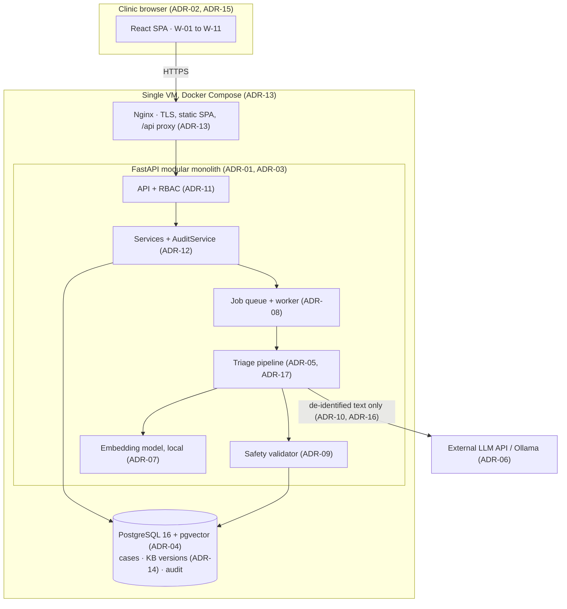

# Architecture Decision Records — TriageAI

**Project:** TriageAI: A Transformer-Based NLP System for Canine and Feline
Symptom Triage and Clinical Decision Support
**Team A-08:** Letada, Alzaga, Bataller — BSCS-3A, Bicol
University College of Science

These records state the architectural decisions behind the system, why they were
made, and what follows from them. **Read the relevant ADR before implementing in
that area.** When code and an ADR disagree, one of them is wrong: fix the code,
or supersede the ADR.

## How to use these records

- Requirement IDs (FR, NFR, IR, DR, SR, BR) refer to the SRS (PD2).
- Wireframe IDs (W-01 … W-11) refer to the clickable prototype in
  `docs/prototype/TriageAI_Prototype.html`.
- ADR-01 to ADR-15 are the records documented in PD7. **ADR-16 and ADR-17 are
  newer** and must be added to PD7 at its next revision.
- Never edit an accepted ADR to change a decision. Write a new ADR that
  supersedes it, and mark the old one `Superseded by ADR-XX`.

## Index

| ADR | Decision | Status |
|---|---|---|
| [ADR-01](ADR-01-modular-monolith.md) | Modular monolith for the backend | Accepted |
| [ADR-02](ADR-02-react-spa.md) | React single-page application | Accepted |
| [ADR-03](ADR-03-python-fastapi.md) | Python 3.11 and FastAPI | Accepted |
| [ADR-04](ADR-04-postgres-pgvector.md) | One PostgreSQL 16 database with pgvector | Accepted |
| [ADR-05](ADR-05-rag-not-finetuning.md) | Retrieval-augmented generation, not fine-tuning | Accepted |
| [ADR-06](ADR-06-llm-provider-adapter.md) | LLM provider adapter, hosted API first | Accepted (model choice pending, TBD-1) |
| [ADR-07](ADR-07-local-embedding-model.md) | Local sentence-embedding model | Accepted (final model pending, TBD-2) |
| [ADR-08](ADR-08-async-jobs-polling.md) | Database job queue and 15-second polling | Accepted |
| [ADR-09](ADR-09-deterministic-safety-validator.md) | Deterministic safety and citation validator | Accepted |
| [ADR-10](ADR-10-deidentification-fail-closed.md) | De-identify before external calls, fail closed | Accepted |
| [ADR-11](ADR-11-cookie-sessions-rbac.md) | Cookie sessions with server-side role checks | Accepted |
| [ADR-12](ADR-12-append-only-audit.md) | Append-only audit trail enforced in the database | Accepted |
| [ADR-13](ADR-13-docker-compose-single-vm.md) | Docker Compose on a single VM, Nginx TLS | Accepted |
| [ADR-14](ADR-14-versioning-reproducibility.md) | Versioned prompts, knowledge base and outputs | Accepted |
| [ADR-15](ADR-15-review-ui-and-vtl-presentation.md) | Three-panel review screen, human-in-the-loop UI | Accepted |
| [ADR-16](ADR-16-english-only-input.md) | English-only input, staff translate at intake | Accepted |
| [ADR-17](ADR-17-mock-first-stage-registry.md) | Mock-first pipeline stages via a registry | Accepted |

## System overview

## Decision map by area

| If you are working on… | Read |
|---|---|
| A new API endpoint or service | ADR-01, ADR-03, ADR-11, ADR-12 |
| A screen or component | ADR-02, ADR-15, ADR-16 |
| The triage pipeline or a stage | ADR-05, ADR-06, ADR-07, ADR-09, ADR-10, ADR-17 |
| Anything touching the database | ADR-04, ADR-12, ADR-14 |
| Background work or job status | ADR-08 |
| Knowledge base or prompts | ADR-05, ADR-14, ADR-07 |
| Evaluation and metrics | ADR-14, ADR-09, ADR-17 |
| Deployment, TLS, backups | ADR-13, ADR-11 |

## Record format

Each record has: status and date, requirements touched, context, the decision
(with concrete names, settings and values), a Mermaid diagram where it clarifies
structure or flow, consequences split into positive and negative, alternatives
considered with the reason for rejection, and implementation notes where they
prevent a predictable mistake.
